

<b>Eksterne aktører</b>

For eksterne aktører ser vi for oss disse sårbarhetene:

Autentisering

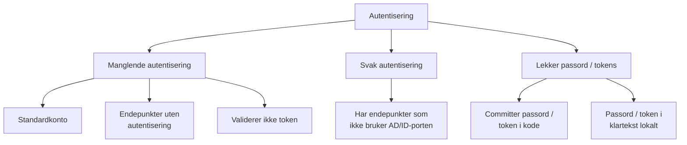

Logging og overvåkning

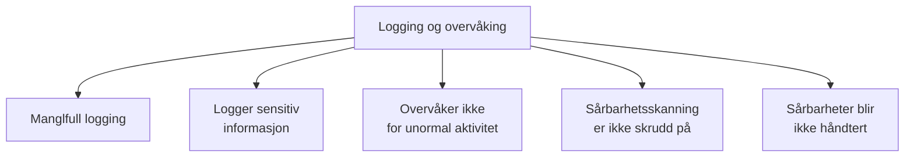

Annet

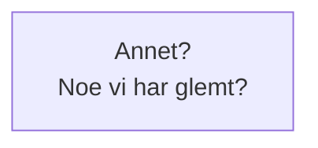

<b>Prosesser</b>

For prosesser ser vi for oss disse sårbarhetene:

Logging og overvåkning

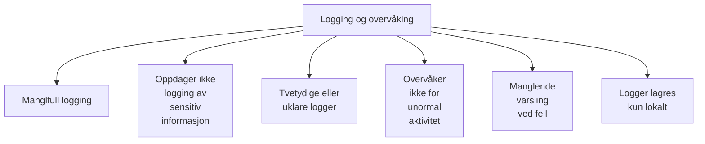

Integritet

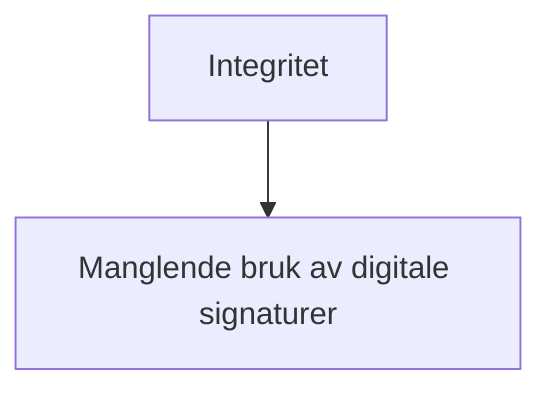

Kryptografi

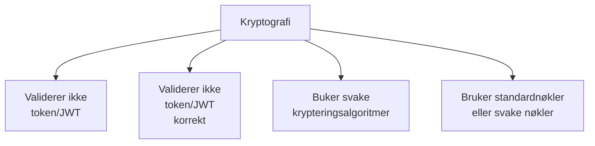

Avhengigheter og programvare

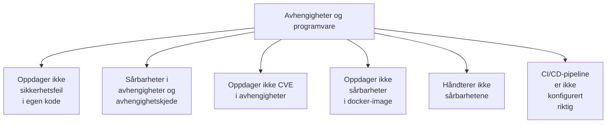

Input

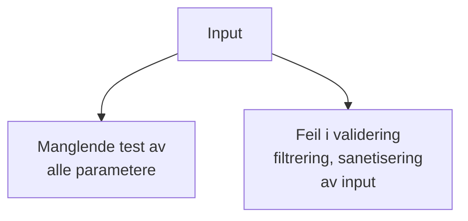

Annet?

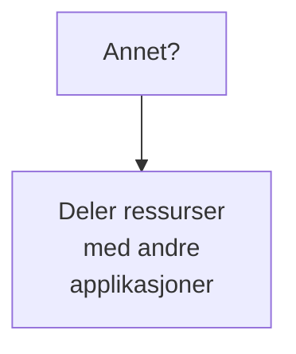

<b>Data og lagring</b>

For data og lagring ser vi for oss disse sårbarhetene:

Autentisering

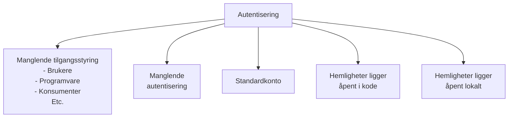

Tjenestenekt

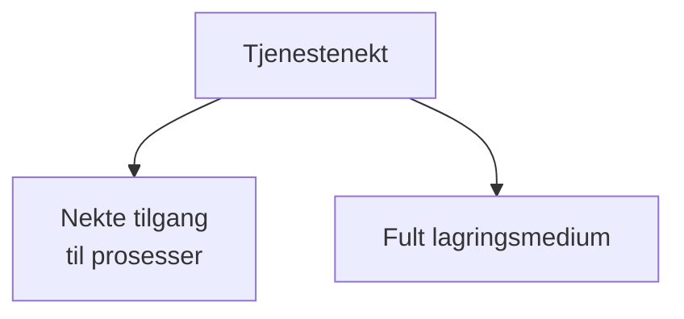

Logging og overvåkning

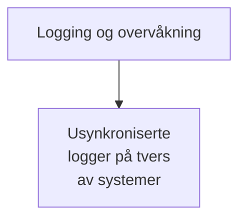

Konfidensialitet

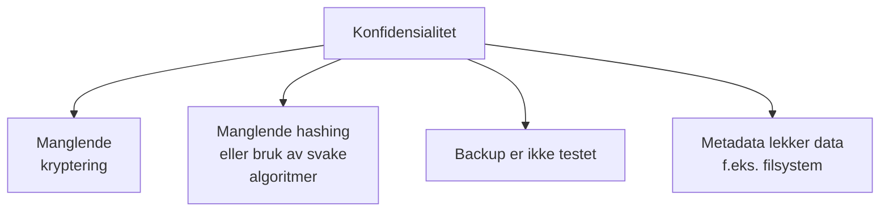

Annet?

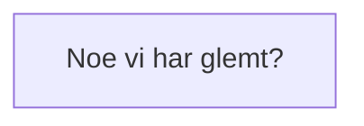

<b>Dataflyt</b>

For dataflyt ser vi for oss disse sårbarhetene:

Autentisering

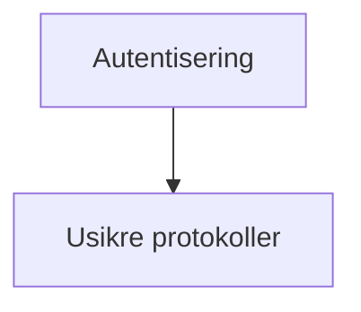

Tjenestenekt

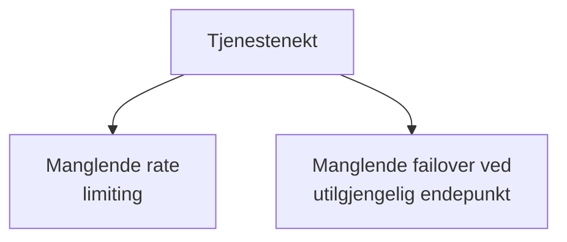

Konfidensialitet

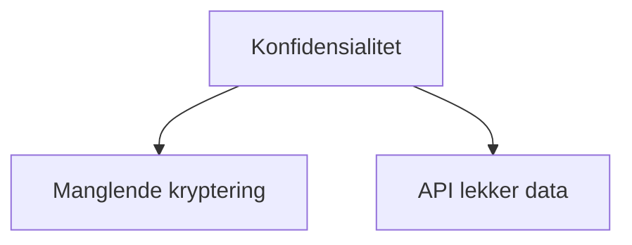

Annet?

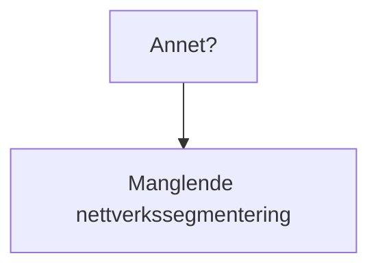

